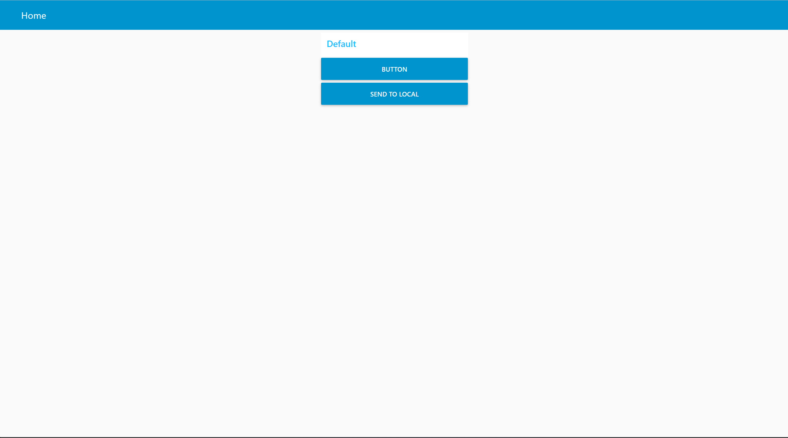

> ### The presentation page is now available on [FRIDGIT](https://ese5160.github.io/a14g-final-submission-t09-k-f-c/)

# a14g-final-submission

    * Team Number: 09
    * Team Name: K.F.C.
    * Team Members: Chen Chen, Kexin Shu
    * Github Repository URL: https://github.com/ese5160/a14g-final-submission-t09-k-f-c
    * Description of test hardware: development boards, qr code reader, light sensor, LCD, laptop
## 1. Video Presentation

[Video](https://youtu.be/FC_td5RAi3Q)

## 2. Project Summary

### 2.1 Device Description

The core vision of our FRIDGIT software is to "simplify and streamline fridge management." The primary functionality of this system revolves around tracking food quantities, logging purchase dates, and issuing expiration reminders. Our system's software is bifurcated into two main components: the Server Software (SS) and the Device Software (DS). Both are equipped with intuitive user interfaces (UIs) designed for ease of use.

This innovative solution employs a QR Code Reader to scan and record the quantity and expiration date of each food item, all of which are uniquely identified with QR codes. The information is then elegantly displayed on an LCD screen, offering users a clear and real-time overview of their remaining food inventory. To enhance user experience and energy efficiency, an Ambient Light Sensor intelligently controls the LCD screen's brightness. Additionally, we designed 2 buttons which allows users to navigate menus and customize settings with ease.

The FRIDGIT system is designed for individuals who find it challenging to keep an accurate mental inventory of their refrigerator's contents. This issue becomes particularly pronounced in households where the fridge is consistently well-stocked, leading to items being forgotten and, regrettably, spoiling. Such neglect not only results in wastage but also poses potential health risks and can negatively affect the quality of other items stored nearby.

Additionally, our system's multi-user capability proves invaluable for those sharing living spaces, such as roommates. FRIDGIT adeptly manages the collective inventory, providing each user with a clear and organized view of their specific food items. This is achieved despite the shared physical storage, ensuring that each user can easily identify and track their groceries.

### 2.2 Inspiration

The idea of our project FRIDGIT born out of the necessity for organized living in shared spaces. In our communal living scenario, where the refrigerator tends to accumulate diverse food items over time, the system is designed to combat forgetfulness and prevent food wastage.

### 2.3 Device Functionality
- Hardware: The device is centered around the SAMW25 microcontroller and integrates key hardware components including the ambient light sensor, and the QR Code reader and LCD.

- Software: SS features a cloud-based UI, enabling users to remotely monitor their food inventory. In contrast, DS boasts a device-resident UI, which facilitates the addition and removal of food items from the system, thereby providing a local inventory checklist. These interfaces are tailored to empower users with seamless management of their fridge contents, whether they are adding new purchases or tracking existing items. Furthermore, the software architecture is crafted to accommodate multiple users, ensuring a collaborative and shared management experience. This is particularly beneficial for households or shared living spaces where fridge contents are communal.

### 2.4 Challenges

- It is kind of tricky to design the layout of PCB due to the appearance of prototype, components' position on board, especially on a relative compact board.
- We did not consider much about the availability when designing the schematics, for each pin on MCU, to be configured as specific function (such as I2C buses). So when we were working on the board, we found us unavailable to achieve the target without doing hardware modification (such as flying wire).
- The development of I2C devices was a big challenge. We spent a lot of time studying and debugging the mechanism of different I2C devices. And we had one component (CAP1203 Touch Slider Module) that we cannot figure out the issue and we had to looking for other solutions.
- Both of our Azure virtual machines was banned by Microsoft. We had to implement it on our local service at last.
- The first version of our 3D-printed container box was short in depth, so it turned out that we cannot fit the battery into it. So we did the second version and made it in time.
- Too many to be listed...

### 2.5 Prototype Learnings

- Be sure leaving "redundant functions" in PCB layout (such as extra pins).
- Add more testpoints to PCB, especially through-hole testpoints in the first design.
- In a real demo, if you can use a simpler to realize a function, do not use the complexer one.
- Get to the place in more advance at demo day to have more time to check the device.

### 2.6 Next Steps

- Continuously debug the system, figure out the reason of fails and make it more robust.
- Add more features, such as cuisine recommendation.
- Reroute the PCB and fix the issues in the first version design.
- ... more to be considered ...

### 2.7 Takeaways from ESE5160

- The ability to design schematics depending on datasheet.
- Drawing PCB layout using Altium Designer.
- Using debugger and serial terminal on debugging.
- Basic usage of FreeRTOS.
- Learning to make migration on different projects.
- Learning to use software frameworks; applying code by reading official documents and examples.
- Lesson-learns:
  - Read datasheet carefully before developing it!
  - Utilize logic analyzer and be careful about connection of hardware.
  - Ask others for help when trapped (especially the teacher).

### 2.8 Project Links

- Project Links
  - URL to your Node-RED: We are running node-red on local service due to the forbidden in our Azure VM. The source code of node-red and additional python web service, please see [A12G/web/](https://github.com/ese5160/a12g-firmware-drivers-t09-k-f-c/tree/main/web)
  - A12G code repository: https://github.com/ese5160/a12g-firmware-drivers-t09-k-f-c
  - final PCBA on Altium 365: https://upenn-eselabs.365.altium.com/designs/folder-5853D6FB-9421-4C9F-A2A8-B61DBEEFAA1B
## 3. Hardware & Software Requirements

### 3.1 Hardware Requirements Specification (HRS)

- **HRS 01** - Project shall be based on SAMW25 microcontroller

- **HRS 02** - VEML6030 Ambient Light Sensor shall be used for adjusting screen brightness. When the light intensity increases, the screen brightness increases; when the light intensity decreases, the screen brightness decreases.

- **HRS 03** - 1.8" diagonal LCD TFT display shall be used for user interface. LCD can display user and menu interface

- **HRS 04** - Two different buttons shall be used to switch the menu and to confirm the selected menu in LCD.

- **HRS 05** - 5744 QR Code reader to I2C shall be used to scan and read QR codes on items in the refrigerator. Each item may be identified by a unique QR code, and the system can identify the item and update inventory information through a QR code reader. 

- **HRS 06** - Buzzer shall beep when QR code reader scans to make inventory-in and inventory-out.

### 3.2 Software Requirements Specification (SRS)

- **SRS 01** - The Server Software (SS) and Device Software (DS) shall establish connectivity via Wi-Fi, enabling seamless data transmission and reception between them.

- **SRS 02** - SS shall be operational on personal computers, while DS shall be operational on the designated hardware device.

- **SRS 03**

   \- DS shall feature a mode selection interface, presenting users with options including:

  - (a) User Selection: This mode allows a user to select their profile from a list of users.
  - (b) Food Log-In: In this mode, DS is ready to register new food items and update their quantities.
  - (c) Food Log-Out: This mode enables DS to decrement the food quantities, reflecting items removed from the fridge.

- **SRS 04** - DS shall incorporate a "database" to systematically store user, food, and settings information. This database will employ a specific data structure, such as linked lists, for other efficient data organization.

- **SRS 06** - DS shall maintain a dynamic dictionary to encode each food item within the fridge. Each food type shall be assigned a unique identifier within this dictionary, which is then stored in the DS database.

- **SRS 07-1**

   \- SS shall provide a user interface (UI) capable of:

  - (a) Identifying and displaying the current user.
  - (b) Showcasing comprehensive details of the food items registered in the DS database.

- **SRS 07-2**

   \- The UI of SS should facilitate:

  - (a) The registration of new users and the de-registration of existing users.

## 4. Project Photos & Screenshots
- Final Project: 
- The standalone PCBA, top: 
- The standalone PCBA, bottom:
- Thermal camera images:
- The Altium Board design in 2D view: 
- The Altium Board design in 3D view:
- Node-RED dashboard
  
- Node-RED backend
  
  
- Web frontend (additional)
  
  
- Block diagram: